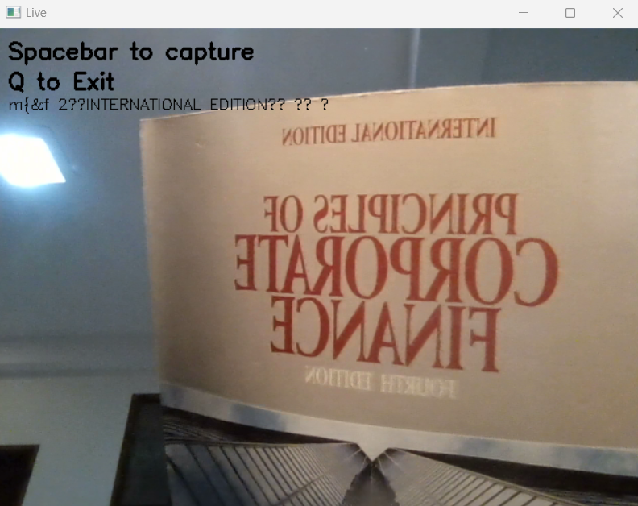
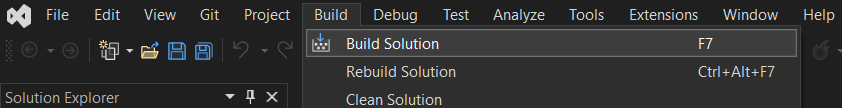
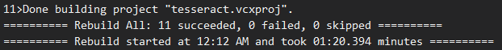
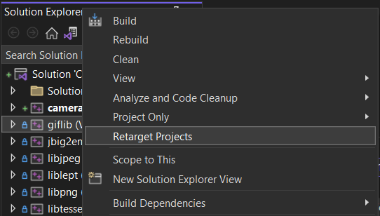
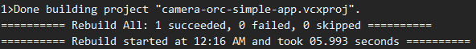
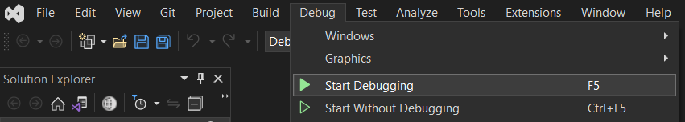
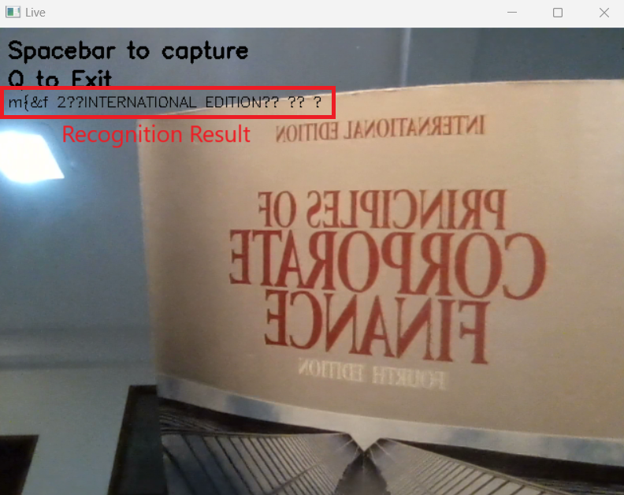
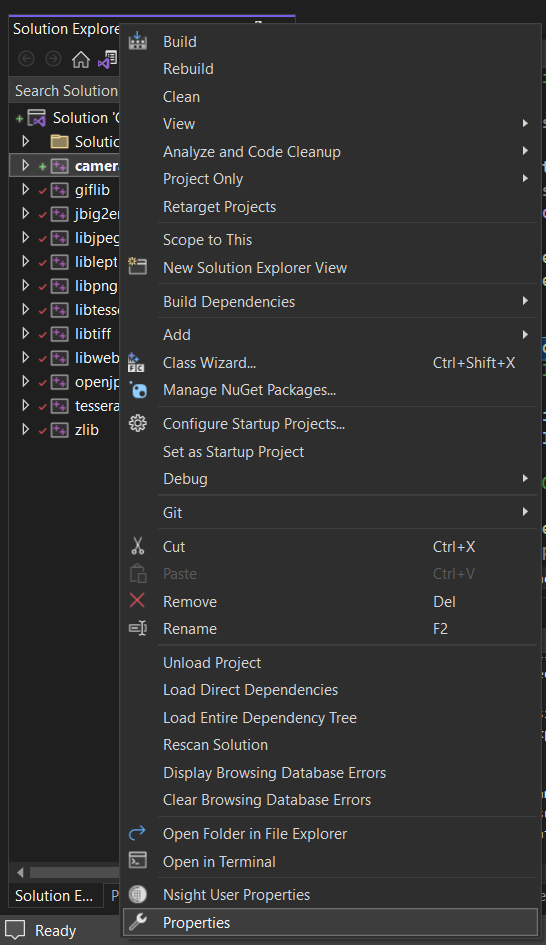
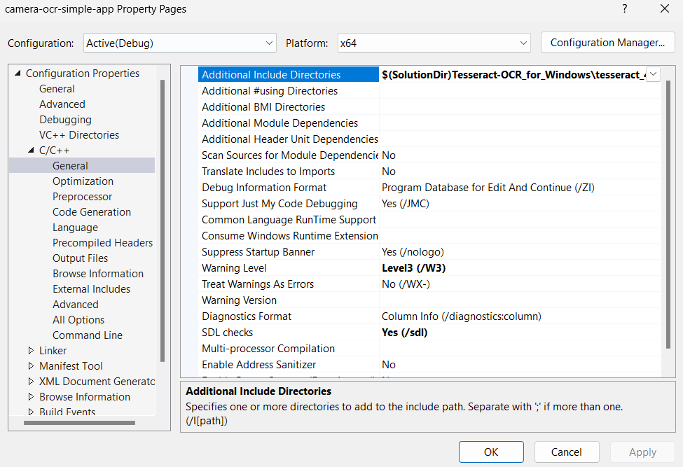

# Camera OCR Simple Application for Windows
A simple Windows console application using OpenCV and Tesseract ORC to recognize charecters through a camera.

> **Disclaimer:** This is an example to setup a project and to use Tesseract in Windows application developement. Its performance and recognition accuracy are not optimized.

	
	
<i>Example of the application window.</i>

**Outline:**
- [Setup Environment](#Setup-Environment)
- [Build Tesseract OCR Library](#build-tesseract-library)
- [Build the Application](#Build-the-Application)
- [Application Demo](#application-demo)
- [Idea in a Nutshell](#idea-in-a-nutshell)
	- [How It Is Built](#how-it-is-built)
	- [How It Works](#how-it-works)

## Setup Environment
>**Remarks: version I used**
>| Tool  | Version |
>| ------------- | ------------- |
>| Visual Studio | Community 2022 |
>| OpenCV  | Windows 4.6 |
>| Tesseract OCR | 4.1 |

Before you build the app, please follow the below guideline.
1. If you have not installed OpenCV yet, please do install it (see https://docs.opencv.org/4.x/d3/d52/tutorial_windows_install.html for OpenCV 4.x).
1. After you installed OpenCV, make sure that you have environment variable `OPENCV_DIR` directing to your OpenCV build directory, e.g. C:\OpenCV4.6\opencv\build\x64\vc15.
1. Clone this repo by following command: 
`git clone https://github.com/rapee9999/Camera-OCR-Simple-App.git` 
`cd Camera-OCR-Simple-App`
1. Fetch and pull Tesseract-OCR_for_Windows repo as a submodule. 
`git submodule init` 
`git submodule update` 
1. Fetch and pull tesseract 4.1 and leptonica repo as submodules under Tesseract-OCR_for_Windows repo.  
`cd Tesseract-OCR_for_Windows` 
`git submodule init` 
`git submodule update` 
1. Why do we need these submodules? [Here is a brief anwser](#how-it-is-built).
1. Now, you have all soure code to build the app.
1. [Build Tesseract library.](#build-tesseract-library)

## Build Tesseract Library
1. In the repo folder, Open `Tesseract-OCR_for_Windows\tesseract.sln` in Visual Studio. You can install Community version, which is free, from [here](https://visualstudio.microsoft.com/thank-you-downloading-visual-studio/?sku=Community&channel=Release&version=VS2022&source=VSLandingPage&passive=false&cid=2030).
1. Build solution by:
	1. Select `Build` in the top menu bar.
	1. Then click `Build Solution`. 
	 
	1. If everything is built successfully, you will get something like 
	 
	in the output console.
		> **If you get Error MSB8020: The build tools for Visual Studio cannot be found.**
		>
		>  Please click right over the error project, and select `Retarget Projects`, and then continue whatever shown in following dialog after you selected (it has to be done project by project). This will upgrade the projects according to the Windows SDK version in your machine. After upgrading the projects completed, start over the building steps above.
		>
		>  
1. Now, the library is built.
1. [Build the app.](#build-the-application)

## Build the Application
1. In the repo folder, open `Camera-OCR-Simple-App.sln` in Visual Studio. You can install Community version, which is free, from [here](https://visualstudio.microsoft.com/thank-you-downloading-visual-studio/?sku=Community&channel=Release&version=VS2022&source=VSLandingPage&passive=false&cid=2030).
1. Build solution by:
	1. Select `Build` in the top menu bar.
	1. Then click `Build Solution`. 
	 
	1. If everything is built successfully, you will get something like 
	 
	in the output console.
1. Now, the application is built. You can run by:
	1. Debugging:
		1. Select `Debug` in the top menu bar.
		1. Then click `Start Debugging`. 
		 
	1. Or run the app directly:
		1. Open your terminal.
		1. Change directory to this repo folder.
		1. Then change directory to x64\Debug\.
		1. Run following command: 
		`Camera-OCR-Simple-App`

## Application Demo
When you run the app, you will see a camera view (the application take stream from the default camera (COM0) connected to your machine). To recognize text, follow below steps:
1. Show a page of words in front of the camera.
1. Press space to capture.
1. Recognition result will show on the app window.
1. Repeat step 2 and 3 to recognize more texts.
1. Press Q to exit the app.

	
	
<i>Recognition result from Tesseract engine in the application window.</i>

## Idea in a Nutshell

### How It Is Built
To build the application, it requires two dependencies: OpenCV and Tesseract OCR, and we need to configure a Visual Studio solution.

The application solution has to include headers, link to .lib and call .dll under OpenCV. Fortunately, you can find pre-built OpenCV for Windows in [the official websiet](https://docs.opencv.org/4.x/d3/d52/tutorial_windows_install.html) where provides everything as it requires above. 

In the same way, we need to include headers and link .lib for Tesseract. However, in contrast to OpenCV, we have to build Tesseract library on our own. Somehow, I cannot build the Windows version from [The official repo](https://github.com/tesseract-ocr/tesseract.git) using the cmake list provided in there. Fortunately, thanks to [peirick](https://github.com/peirick). They sorted out a solution for Windows in [Tesseract-OCR_for_Windows repo](https://github.com/peirick/Tesseract-OCR_for_Windows.git). Therefore, I can build the application (Visual Studio) solution on top of the peirick's repo, as a submodule in this repo. You can check out `tesseract.sln` in the peirick's repo for the original solution.

For more details about project configurations (including headers, linking .lib and preparing .dll), have a look at Carmera-OCR-Simple-App project property in `Camera-OCR-Simple-App.sln` using Visual Studio as following guidelines:

 

 

- *Configuration Properties > C/C++ > General > Additional Include Derectories* 
For adding where OpenCV and Tesseract's headers are,
- *Configuration Properties > Linker > General > Additional Library Derectories* 
For adding where OpenCV's and Tesseract's libraries are,
- *Configuration Properties > Linker > Input > Additional Dependencies* 
For declaring OpenCV's and Tesseract's libraries,
- *Configuration Properties > Build Events > Post-Build Event > Command Line* 
For preparing OpenCV's dlls and Tesseract's training data.

### How It Works
Take [`camera-orc-simple-app\main.cpp`](camera-orc-simple-app\main.cpp) file as an example to a Tesseract's use case.
